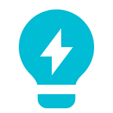

## `console.log("Hello World! 👋🏻, I'm Kishan");`

### I am a Full-Stack Software Engineer & Google Cloud Architect &nbsp;

 &nbsp; Always exploring new technologies and developing softwares no one will use 🥲

 &nbsp; Love working on React frontends and Nodejs backends

 &nbsp; When I am not in front of the computer I am behind the camera

<picture>
  <source
    srcset="./assets/shell-light.png"
    media="(prefers-color-scheme: dark)"
  />
  <source
    srcset="./assets/shell-dark.png"
    media="(prefers-color-scheme: light), (prefers-color-scheme: no-preference)"
  />
   &nbsp; Currently learning Devops and Python
</picture>   

 &nbsp; I spend my weekends like this 👇🏻

&nbsp;&nbsp;&nbsp;&nbsp;&nbsp;&nbsp;&nbsp;&nbsp;&nbsp; 

## My Certifications &nbsp;

- [Google Cloud: Professional Cloud Architect](https://www.credly.com/badges/bcff1d62-7cf4-46b1-8dc5-a8e61fc4956c/public_url)
- [Google Cloud: Associate Cloud Engineer](https://www.credly.com/badges/2f0f0fc4-a2e5-4598-bdc3-d37e212295ec/public_url)
- [HashiCorp: Terraform](https://www.credly.com/badges/8b6fad89-c458-42c7-9916-4ad7d3d69eb1/public_url)

&nbsp;&nbsp;&nbsp;&nbsp;&nbsp;&nbsp;
 &nbsp;&nbsp;&nbsp;

## Connect with me &nbsp;

