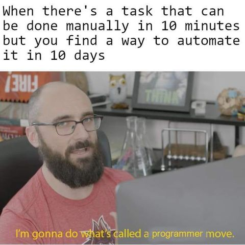

## `console.log("Hello World! 👋🏻, I'm Kishan");`

### I am a Full-Stack Software Engineer & Google Cloud Architect &nbsp;

 &nbsp; Always exploring new technologies and developing softwares no one will use 🥲

 &nbsp; Love working on React frontends and Nodejs backends

 &nbsp; When I am not in front of the computer I am behind the camera

<picture>
  <source
    srcset="./assets/shell-light.png"
    media="(prefers-color-scheme: dark)"
  />
  <source
    srcset="./assets/shell-dark.png"
    media="(prefers-color-scheme: light), (prefers-color-scheme: no-preference)"
  />
   &nbsp; Currently learning Devops and Python
</picture>   

 &nbsp; I spend my weekends like this 👇🏻

&nbsp;&nbsp;&nbsp;&nbsp;&nbsp;&nbsp;&nbsp;&nbsp;&nbsp; 

 

## My Certifications &nbsp;

- [Google Cloud: Professional Cloud Architect](https://www.credly.com/badges/bcff1d62-7cf4-46b1-8dc5-a8e61fc4956c/public_url)
- [Google Cloud: Associate Cloud Engineer](https://www.credly.com/badges/2f0f0fc4-a2e5-4598-bdc3-d37e212295ec/public_url)
- [HashiCorp: Terraform](https://www.credly.com/badges/8b6fad89-c458-42c7-9916-4ad7d3d69eb1/public_url)

 

&nbsp;&nbsp;&nbsp;&nbsp;&nbsp;&nbsp;
 &nbsp;&nbsp;&nbsp;

 

## Tech Stack &nbsp;

##### Basics

##### Languages & Frameworks

##### Databases

##### Containers, Cloud & Automation

![GCP](https://img.shields.io/badge/-Google%20Cloud-000?logo=data:image/svg%2bxml;base64,PHN2ZyB4bWxucz0iaHR0cDovL3d3dy53My5vcmcvMjAwMC9zdmciIHdpZHRoPSI2NCIgaGVpZ2h0PSI2NCI+PHBhdGggZD0iTTQwLjcyOCAyMC40ODhsMi4wNS4wMzUgNS41Ny01LjU3LjI3LTIuMzZDNDQuMiA4LjY1NyAzOC4zNjcgNi4yNiAzMS45OTMgNi4yNmMtMTEuNTQgMC0yMS4yOCA3Ljg1Mi0yNC4xNjMgMTguNDg4LjYwOC0uNDI0IDEuOTA4LS4xMDYgMS45MDgtLjEwNmwxMS4xMy0xLjgzcy41NzItLjk0Ny44NjItLjlBMTMuODggMTMuODggMCAwIDEgMzIgMTcuMzc1YzMuMy4wMDcgNi4zNCAxLjE3MyA4LjcyOCAzLjEwMnoiIGZpbGw9IiNlYTQzMzUiLz48cGF0aCBkPSJNNTYuMTcgMjQuNzdjLTEuMjkzLTQuNzctMy45NTgtOC45ODItNy41NTUtMTIuMTc3bC03Ljg4NyA3Ljg4N2MzLjE2IDIuNTUgNS4xODcgNi40NTIgNS4xODcgMTAuODJ2MS4zOTJjMy44MzcgMCA2Ljk1NCAzLjEyNCA2Ljk1NCA2Ljk1NCAwIDMuODM3LTMuMTI0IDYuOTU0LTYuOTU0IDYuOTU0SDMyLjAwN0wzMC42MTUgNDh2OC4zNDZsMS4zOTIgMS4zODVoMTMuOTA4QTE4LjExIDE4LjExIDAgMCAwIDY0IDM5LjY0N2MtLjAwNy02LjE1NS0zLjEtMTEuNi03LjgzLTE0Ljg3NnoiIGZpbGw9IiM0Mjg1ZjQiLz48cGF0aCBkPSJNMTguMDg1IDU3Ljc0aDEzLjlWNDYuNmgtMTMuOWE2Ljg5IDYuODkgMCAwIDEtMi44NjItLjYyMmwtMi4wMDcuNjE1LTUuNTcgNS41Ny0uNDg4IDEuODhhMTggMTggMCAwIDAgMTAuOTI2IDMuNjg5eiIgZmlsbD0iIzM0YTg1MyIvPjxwYXRoIGQ9Ik0xOC4wODUgMjEuNTdBMTguMTEgMTguMTEgMCAwIDAgMCAzOS42NTRjMCA1Ljg3MyAyLjgxMyAxMS4wOTUgNy4xNjYgMTQuNDAzbDguMDY0LTguMDY0YTYuOTYgNi45NiAwIDAgMS00LjA5OS02LjMzOWMwLTMuODM3IDMuMTI0LTYuOTU0IDYuOTU0LTYuOTU0IDIuODIgMCA1LjI0NCAxLjcgNi4zNCA0LjFsOC4wNjQtOC4wNjRjLTMuMzA3LTQuMzUzLTguNTMtNy4xNjYtMTQuNDAzLTcuMTY2eiIgZmlsbD0iI2ZiYmMwNSIvPjwvc3ZnPg==)

 

## Connect with me &nbsp;

